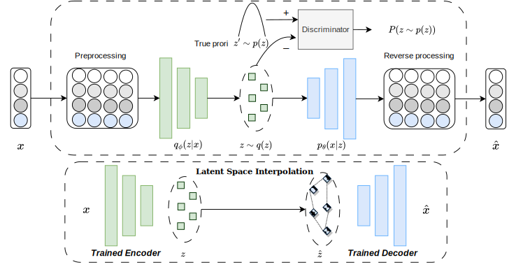

# Deterministic Autoencoder using Wasserstein Loss for Tabular Data Generation
#### Alex X. Wang and Binh P. Nguyen(https://people.wgtn.ac.nz/b.nguyen) ∗

## Abstract
Tabular data generation is a complex task due to its distinctive characteristics and inherent complexities. While Variational Autoencoders have been adapted from the computer vision domain for tabular data synthesis, their reliance on non-deterministic latent space regularization introduces limitations. The stochastic nature of Variational Autoencoders can contribute to collapsed posteriors, yielding suboptimal outcomes and limiting control over the latent space. This characteristic also constrains the exploration of latent space interpolation. To address these challenges, we present the Tabular Wasserstein Autoencoder (TWAE), leveraging the deterministic encoding mechanism of Wasserstein Autoencoders. This characteristic facilitates a deterministic mapping of inputs to latent codes, enhancing the stability and expressiveness of our model's latent space. This, in turn, enables seamless integration with shallow interpolation mechanisms like the synthetic minority over-sampling technique (SMOTE) within the data generation process via deep learning. Specifically, TWAE is trained once to establish a low-dimensional representation of real data, and various latent interpolation methods efficiently generate synthetic latent points, achieving a balance between accuracy and efficiency. Extensive experiments consistently demonstrate TWAE's superiority, showcasing its versatility across diverse feature types and dataset sizes. This innovative approach, combining WAE principles with shallow interpolation, effectively leverages SMOTE's advantages, establishing TWAE as a robust solution for complex tabular data synthesis.

## Illustration of TTVAE with latent space interpolation


### A detailed demo can be found in Demo_TWAE.ipynb.
### Installing Dependencies

Python version: 3.10

```
pip install -r requirements.txt
```
### Preparing Datasets

#### Save dataset properties into JSON file in the following folder.
\data_profile\{dataname.json}

#### Download raw dataset:

```
python s1_download_dataset.py
```
#### Process dataset:

```
python s2_process_dataset.py
```
### Training Models

For non-deep models, including SMOTE and its variants, Synthpop, Copula and traditional deep generative models, including CTGAN, TVAE and CopulaGan, use the following code

```
python main.py --dataname [NAME_OF_DATASET] --method [NAME_OF_METHODS] --mode train
```

Options of [NAME_OF_DATASET] in the sample code: adult, abalone
Options of [NAME_OF_METHODS]: smote, synthpop, copula, ctgan, tvae and copulagan

For other more advanced deep generative models, we break down the process into model training and data sampling:
```
python main.py --dataname [NAME_OF_DATASET] --method [NAME_OF_METHODS] --mode train
```

```
python main.py --dataname [NAME_OF_DATASET] --method [NAME_OF_METHODS] --mode sample
```
Options of [NAME_OF_DATASET] in the sample code: adult, abalone
Options of [NAME_OF_METHODS]: ctabgan,tabddpm and twae

### License

This project is licensed under the Apache-2.0 License.

### Reference
We appreciate your citations if you find this repository useful to your research!
```
@article{wang2025twae,
  title={{Deterministic Autoencoder using Wasserstein Loss for Tabular Data Generation}},
  author={Alex X. Wang and Binh P. Nguyen},
  journal={Neural Networks},
  year={2025},
  publisher={Elsevier}
}
```
